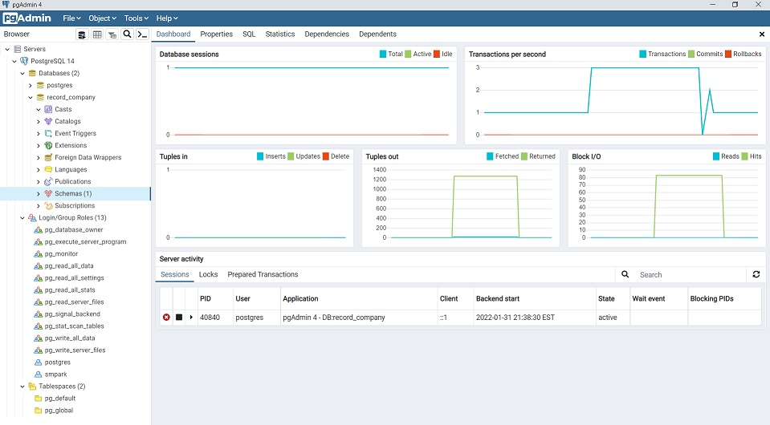

### Install PostgreSQL DBMS : MG-245 Lab. Session

**_School of Arts and Science, Carolina University_**

---

#### 1. Install PostgreSQL

> -   Download and Install PostgreSQL on your machine's Operating System
>     -   Download [_PostgreSQL_](https://www.enterprisedb.com/downloads/postgres-postgresql-downloads)
>     -   Select all components: _PostgreSQL Server, pgAdmin 4, Stack Builder, Command Line Tools_

#### 2. DBMS Administeration

> -   **Option-1: Command Line -> Open SQL Shell(psql)** - Refer to [psql shell commands](https://www.postgresql.org/docs/14/app-psql.html) > `select version();` > `\h` > `\?` > `\q` - Refer to [SQL Statements](https://www.w3schools.com/sql/) > `CREATE TABLE employee (` > `id INT NOT NULL,` > `lastname VARCHAR(30) NOT NULL` > `firstname VARCHAR(30) NOT NULL` > `branch VARCHAR(30)` > `PRIMARY KEY (id)` > `);` > `SELECT * FROM employee;`
> -   **Option-2: GUI -> pgAdmin 4** > 

#### 3. PostgreSQL Documents

> -   PostgreSQL [Documentation](https://www.postgresql.org/docs/14/index.html)
> -   PostgreSQL [Manuals](https://www.postgresql.org/docs/)
> -   PostgreSQL [Tutorial-1](https://www.postgresqltutorial.com/)
> -   PostgreSQL [Tutorial-2](https://www.w3schools.blog/postgresql-tutorial)
