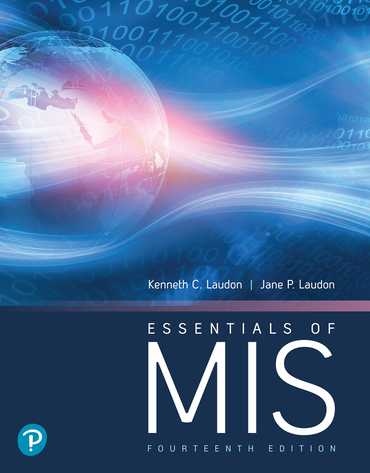

<h6>ver. Dec-2021.</h6>
<h2>MG 245 "Management of Information Systems" </h2>
<h4 style="color:green"><i> Prof. Sangmork "SAM" Park (Col(R). ROKAF)</i></h4>
<h5><u><i>School of Arts and Science, Carolina University</i></u></h5>

<h4>Textbook:</h4> 

<em><u>[Kennth Lauden & Jane Lauden, 2020. "Essentials of Management Information Systems, 14th Edition", New Yourk University](https://www.pearson.com/en-us/subject-catalog/p/essentials-of-mis/P200000001391/9780136500636)</u></em>

<!-- ---
<h4>Prerequisites</h4>
--- -->

<!-- ---
<h4>Course description</h4>
---  -->

<h4>Course Schedule</h4>

<h5>Week-1: </h5>

-   Business Information Systems in Your Career
    -   What is MIS?
    -   Why the information systems are essential for business?
    -   Four-step method for business problem solving
    -   What information systems skills and knowledge are essential for bysiness career
-   Golbal E-business and Collaboration
    -   The role of information systems in business
    -   Technologies used for collaboration, social business, and knowledge management
-   Quiz#1, Project#1 (Lab environment setup)

<h5>Week-2: </h5>

-   Acheving Competitive Advantage with Information Systems
    -   Information System Strategy
    -   The Internet and Globalization
    -   The role of BPM(Business Process Management)
-   Ethical and Social Issues in Information Systems
    -   Ethical, social, and political issues raised by information systems
    -   Principles and guidance for ethical decision
    -   Protection of individual privacy and intellectual property
    -   Legal systems for establishing accountability and liability, qualit of everyday life
-   Quiz#2, Rearch#1

<h5>Week-3: </h5>

-   IT Infrastructure: Hardware and Software
    -   IT infrastructure components
    -   Computer hardware, software technlolgy, TCO(Total Cost of Ownership)
    -   Technology service provider, mibile platform management
-   Foundation of Business Intelligence: Databases and Information Management
    -   Relational database, DBMS(Database Management Systems), SQL(Structured Qyery Language)
    -   Non-relational database, Cloud databases, and Blockchain
    -   Data governance and data quality
-   Quiz#3, Report#2

<h5>Week-4: </h5>

-   Telecommunications, the Internet, and Wireless Technology
    -   Principla components of telecommunications networks and networking technologies
    -   The Internet and Internet technology
    -   The Web, IOT(Internet of Things)
    -   Wireless technology
-   Securing Information Systems
    -   Vulnerability of informatin systems
    -   Malwares(Viruses, Worms, Trojan horses, etc.), hackers, and computer crime
    -   Legal and regulatory requirement for electronic records management
    -   Security policy, security frameworks, diaster recovery
-   Mid-term exam, Report#3

<h5>Week-5: </h5>

-   Achieving Operational Excellence and Customer Intimacy: Enterprise Applications
    -   Enterprise system and business operation
    -   Supply chain management system
    -   Customer relationship management system
-   E-commerce: Digital Markets, Digital Goods
    -   The new E-commerce: Social, Mobile, Local
    -   E-commerce business model
    -   E-commerce revenue model
-   Quiz#4, Report#4

<h5>Week-6: </h5>

-   Imporving Decision Making and Managing Artificial Intelligence
    -   Types of decision, decision making process
    -   AI(Artificial Intelligence), ML(Machine Learneing), Expert Systems, Neural Networks, Genetic Algorithm, Natural Language Processing, Computer Vision Systems, Robotics, etc.
-   Quiz#5, Report#5

<h5>Week-7: </h5>

-   Making the Business Case for Information Systems and Managing Projects
    -   Managing information systems development
    -   Problem-solving steps for developing a new information systems
    -   Alternatives for building information systems
-   Final exam, Final Project/Report

---

<h4>References</h4>
