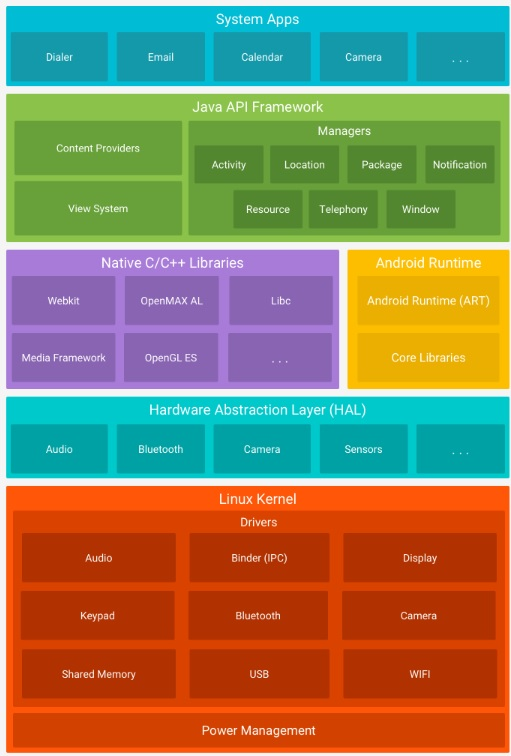

<h6>ver. Nov-2023</h6>
<h3>Android Development Roadmap </h3>

---

<h4>Android? </h4>
1. Android Framework Architeture

&emsp; This image came from [https://developer.android.com/guide/platform](https://developer.android.com/guide/platform)

&emsp; &emsp; 

 

2. Android Application Development Components
    <ol>
    <li>Activity</li>
    <li>Service</li>
    <li>BroadcastReceiver</li>
    <li>ContentProvider</li>
    </ol> 

    Example: Develop an "Alarm App"
    | Components | Contents |  
    |------------ |----------------------------------|
    | Activity | UI where you shall set alarm |
    | ContentProvider | Whare data is saved |  
    | 7:00 AM | Service |  
    | BroadcastReceiver | Event Handling |

     

3. Android Studio Folders
 <ul>
 <li><b>manifests</b>: describes the fundamental characteristics of the app and defines each of its components</li>
 <li><b>java</b>: contains the .java source files for your project. By default, it includes an MainActivity.java file</li>
 <li><b>res</b>: a directory for files that define your app's user interface</li>
 <li><b>Gradle Scripts</b>: an auto generated file which contains compileSdkVersion, buildToolsVersion, applicationId, minSdkVersion, targetSdkVersion, versionCode and versionName</li>
 </ul>

 <h4>Baseline: </h4>

<ul>
<li>Android Fundamentals</li>
<li>Kotlin (Optional)</li>
<li>Jetpack Compose</li>
<li>XML</li>
&emsp;- Transfer and share data
<li>Database</li>
&emsp;- Save data to your local device
<li>Retrofit</li>
&emsp;- Interact with remote APIs
<li>Asynchronours Programming</li>
</ul>

<h4>Practices: </h4>
<ol><em>
<li>Building Basic UI</li>
<li>Activities</li>
<li>Fragments</li>
<li>Navigation</li>
<li>Permission Handling</li>
<li>Notifications</li>
<li>Authentication</li>
<li>Cashing Strategy</li>
<li>Reminders</li>
<li>Data Synchronization, etc.</li>
</em></ol> 

<h5>1. Android Application Development Componets</h5>
<h>
