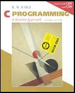

<h6>ver. Nov-2023</h6>
<h3>CS-211 "Internet & Mobile Programming" </h3>
<h5><i> Prof. Sangmork "SAM" Park</i></h5>

<em>[Department of CIS, Virginia Military Institute](https://www.vmi.edu/academics/departments/computer-and-information-sciences/) </em>

---

<h4>Prerequisites: </h4>
<ul>
<li>Basic understanding in programming</li>
</ul>
<h4>Course description:</h4>
&emsp; " Under construction "

<!-- This course is designed for students with little programming knowledge and experience to prepare for more advanced programming courses.
It covers elementary concepts and skills of computer programming and provides a foundation or learning additional aspects of programming by demonstrating problem-solving techniques and program design methodologies using C/C++. Topics include fundamentals of computer systems and programming, selection and iteration controls, functions, arrays, basic computer terminology, and software evelopment principles. C programming language will be introduced and touched on to explain the basics of computer programming during lectures. Students are required to use C/C++ in programming lab classes and course assignments. -->

---

<h4>Textbook</h4>
<h5>A. Mobile Programming :</h5>
&emsp; <em>(Tentative)</em> Mobile App Development with Android and Java
<h5>B. Internet Programming :</h5>
&emsp; <em>(Tentative)</em> Web Programming with zyLabs

---

<h4>Lab Environment Setup</h4>

<h5>A. Mobile Programming :</h5>
<ol> 
<li>Install Java: "JDK/JRE" </li>

:point_right: [Download Java from ORACLE](https://www.oracle.com/java/technologies/downloads)

```
$java --version

java 18.0.1.1 2022-04-22
Java(TM) SE Runtime Environment (build 18.0.1.1+2-6)
Java HotSpot(TM) 64-Bit Server VM (build 18.0.1.1+2-6, mixed mode, sharing)
```

<li>Install IDE: "Android Studio" </li>

:point_right: [Download Android Studio from Android](https://www.oracle.com/java/technologies/downloads) </li>

<li>An Android phone for testing your project</li>

</ol><br>

<h5>B. Internet Programming :</h5>
<ol> 
<li>Install a Text Editor: "Visual Studio Code" preferred </li>

:point_right: [Download Visual Studio Code](https://code.visualstudio.com/download) </li>

<li>Install HTML/CSS/JavaScript extensions: "Prettier", "Live Server",  "JavaScript (ES6) code snippets", "HTML CSS Support", "ESLint", "GitLens", + ...</li><br>
<li>Create GitHub Account

:point_right: [Sign up to GitHub](https://github.com/)</li>

<li>Create GitHub Repositories and link them with your Visual Studio Code

:point_right: [Refer to silverwing-coder's GitHub.MD](<https://github.com/silverwing-coder/Miscellaneous/blob/master/(Manual)GitHub.md>)

</li>
</ol>

---

<h4>References</h4>

1. [W3CSchools](https://www.w3schools.com/)

2. [Tutorialpoint](https://www.tutorialspoint.com/index.htm)

3. [Android Basics with Compose](https://developer.android.com/courses/android-basics-compose/course)

<!-- 

<em><u>[Daniel Liang, "Introduction to Programming with C++, 3rd edition"](https://www.pearson.com/en-us/subject-catalog/p/introduction-to-programming-with-c/P200000003422/9780137558599)</u></em>

<h4>Reference Book:</h4>


<em><u>[K.N. King, "C Progrmming - A Modern Approach](https://www.amazon.com/C-Programming-Modern-Approach-2nd/dp/0393979504/ref=sr_1_1?crid=2S484SJ0F15VP&keywords=C+Programming+%E2%80%93+A+Modern+Approach+2nd+Edition%2C+K.N.+King.&qid=1670953505&sprefix=c+programming+a+modern+approach+2nd+edition%2C+k.n.+king.%2Caps%2C273&sr=8-1)</u></em>

---

<h4>Prerequisites: Not Appliclible</h4>
<h4>Course description:</h4>
This course is designed for students with little programming knowledge and experience to prepare for more advanced programming courses. It covers elementary concepts and skills of computer programming and provides a foundation or learning additional aspects of programming by demonstrating problem-solving techniques and program design methodologies using C/C++. Topics include fundamentals of computer systems and programming, selection and iteration controls, functions, arrays, basic computer terminology, and software evelopment principles. C programming language will be introduced and touched on to explain the basics of computer programming during lectures. Students are required to use C/C++ in programming lab classes and course assignments.

---

<h4>Course Schedule</h4>

<h5>Week-1: </h5>

-   Introduction to Computers, Programs, and C / C++
-   Quiz#1, Project#1

<h5>Week-2: </h5>

-   Elementary Programming (Variables)
-   Quiz#2, Project#2

<h5>Week-3: </h5>

-   Selections
-   Quiz#3, Project#3

<h5>Week-4: </h5>

-   Mathematical Functions, Characters, and Strings
-   Mid-term exam, Project#4

<h5>Week-5: </h5>

-   Loops
-   Functions
-   Quiz#4, Project#5

<h5>Week-6: </h5>

-   Single-dimensional Arrays, and C-Strings
-   Quiz#5, Project#6

<h5>Week-7: </h5>

-   Multi-dimensional Arrays
-   Final exam, Final Project

---

<h4>Lab Environment Setup</h4>

-   [C/C++ Programming Lab Environment Setup](LabEnvSetup.md)

---

<h4>References</h4>

1. C programming (W3 School): https://www.w3schools.com/c/index.php
2. C programming (Tutorialpoint): https://www.tutorialspoint.com/cprogramming/index.htm

3. C++ programming (W3 School): https://www.w3schools.com/cpp/
4. C++ programming (Tutorialpoint): https://www.tutorialspoint.com/cplusplus/index.htm -->
