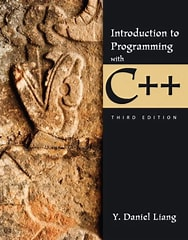

<h6>ver. Dec-2022</h6>
<h3>CS-111 "Programming-2 : C++" </h3>
<h5><i> Prof. Sangmork "SAM" Park (Col(R). ROKAF)</i></h5>
<h5><u><i>School of Arts and Science, Carolina University</i></u></h5>

---

<h4>Textbook:</h4> 

<em><u>[Daniel Liang, "Introduction to Programming with C++, 3rd edition"](https://www.pearson.com/en-us/subject-catalog/p/introduction-to-programming-with-c/P200000003422/9780137558599)</u></em>

---

<h4>Prerequisites: CS 110 (Programming-1)</h4>
<h4>Course description:</h4>
The course materials are the textbook, presentation slides, web-article reading, and programming tools on a personal computer. Students are required to set up programming environments with open-source programming tools distributed on the Web. Since this course is for students with basic programming knowledge and experience, active and extensive research and readings related to the topics we study in classes will be required.

---

<h4>Course Schedule</h4>

<h5>Week-1: </h5>

-   Objects and Classes
-   Object-oriented Thinking
-   Quiz#1, Project#1

<h5>Week-2: </h5>

-   Pointers and Memory Management
-   Quiz#2, Project#2

<h5>Week-3: </h5>

-   Templates, Vectors, and Stacks
-   Quiz#3, Project#3

<h5>Week-4: </h5>

-   File Input and Output
-   Operator Overloading
-   Mid-term exam, Project#4

<h5>Week-5: </h5>

-   Inheritance and Polymorphism
-   Quiz#4, Project#5

<h5>Week-6: </h5>

-   Error Handling
-   Quiz#5, Project#6

<h5>Week-7: </h5>

-   Recursion
-   Final exam, Final Project

---

<h4>Lab Environment Setup</h4>

-   [C/C++ Programming Lab Environment Setup](<https://github.com/silverwing-coder/ComputerProgramming/blob/master/CS110%24Programming-1(C%26C%2B%2B)/LabEnvSetup.md>)

---

<h4>References</h4>

1. C programming (W3 School): https://www.w3schools.com/c/index.php
2. C programming (Tutorialpoint): https://www.tutorialspoint.com/cprogramming/index.htm

3. C++ programming (W3 School): https://www.w3schools.com/cpp/
4. C++ programming (Tutorialpoint): https://www.tutorialspoint.com/cplusplus/index.htm
