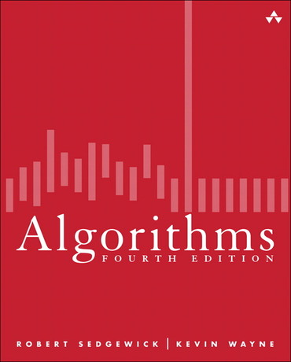

<h6>Ver. May-2022.</h6>
<h2> CS 210 : Algorithm and Data Structures - 1 </h2>
<h4 style="color:green"><i> Prof. Sangmork "SAM" Park (Col(R). ROKAF)</i></h4>
<h5><u><i>School of Arts and Science, Carolina University</i></u></h5>

<h4>Textbook:</h4> 

<em><u>[Robert Sedgewick and Kevin Wayne, 2011. "Algorithms, 4th edition", Princeton University](https://www.pearson.com/en-us/subject-catalog/p/algorithms/P200000000597/9780321573513?creative=544666367026&keyword=&matchtype=&network=u&device=c&gclid=Cj0KCQjwmdGYBhDRARIsABmSEeOR1bE8eBQrhV9t569r2zpXKWBzSlJAky5Bb1Azmz7QuB8b3wvmuoIaAogMEALw_wcB&gclsrc=aw.ds)</u></em>

<h4>Prerequisites:</h4>

-   Programming (C++ / Java)

---

<h4>Course description</h4>

-   This course covers the overview of data structure and algorithms which enable us to integrate problem-solving processes, programming knowledge and techniques on the data structure and algorithms basis.
-   CS 210 and CS 310 are a continuous course that deals with different algorithms and data structures topics.

---

<h4>Course Schedule</h4>

<h5>Week-1: </h5>

-   Basic Programming Model (Intro. To Java)
-   Data Abstraction (ADTs)
-   Quiz#1, Hands-on Project#1

<h5>Week-2: </h5>

-   Bags, Queues, and Stacks
-   Quiz#2, Hands-on Project#2

<h5>Week-3: </h5>

-   Analysis of Algorithms (Time/Memory cost)
-   Quiz#3, Hands-on Project#3

<h5>Week-4: </h5>

-   Union-Find
-   Mid-term exam, Hands-on Project#4

<h5>Week-5: </h5>

-   Elementary Sorts
-   Mergesort/Quicksort
-   Quiz#4, Hands-on Project#5

<h5>Week-6: </h5>

-   Priority Queues
-   Comparators, Stability, Median, and Order Statistics
-   Quiz#5, Hands-on Project#6

<h5>Week-7: </h5>

-   Symbol Tables
-   Final exam, Final Project

---

<h4>References</h4>

1. [Textbook(Algorithms, 4th edition) Home](https://algs4.cs.princeton.edu/home/)
2. [Data Structure Visualization.](https://www.cs.usfca.edu/~galles/visualization/Algorithms.html)
3. [500 Data Structures and Algorithms practice problems and solutions](https://kingrayhan.medium.com/500-data-structures-and-algorithms-practice-problems-and-their-solutions-b45a83d803f0)
4. <em style="color:red"><u> (+) Course materials provided in class </u></em>
