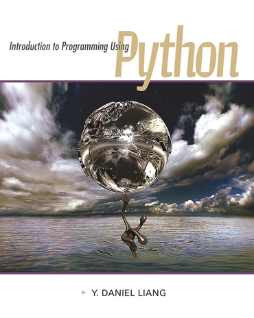

<h6>ver. Aug-2021.</h6>
<h3>IS-370 "Programming-1 : Python" </h3>
<h5 style="color:green"><i> Prof. Sangmork "SAM" Park (Col(R). ROKAF)</i></h5>
<h5><u><i>School of Arts and Science, Carolina University</i></u></h5>

---

<h4>Textbook:</h4> 

<em><u>[Daniel Liang, 2021. "Introduction to Programming Using Python, 1st edition", Georgia Southern University](https://www.pearson.com/en-us/subject-catalog/p/introduction-to-programming-using-python/P200000003454/9780137521272)</u></em>

---

<!-- ---
<h4>Prerequisites</h4>
--- -->

<!-- ---
<h4>Course description</h4>
---  -->

<h4>Course Schedule</h4>

<h5>Week-1: </h5>

-   Quiz#1, Project#1

<h5>Week-2: </h5>

-   Quiz#2, Project#2

<h5>Week-3: </h5>

-   Quiz#3, Project#3

<h5>Week-4: </h5>

-   Mid-term exam, Project#4

<h5>Week-5: </h5>

-   Quiz#4, Project#5

<h5>Week-6: </h5>

-   Quiz#5, Project#6

<h5>Week-7: </h5>

-   Final exam, Final Project

---

<h4>References</h4>

1. W3School: https://www.w3schools.com/python/
2. Tutorialpoint: https://www.tutorialspoint.com/python/index.htm
3. ThePythonGuru: https://thepythonguru.com/
4. AwesomePython(GitHub): https://github.com/vinta/awesome-python
